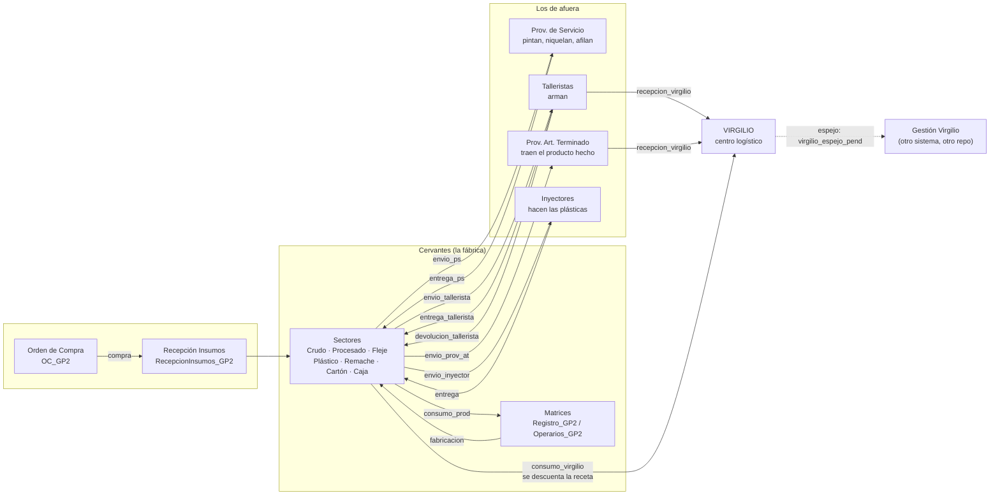
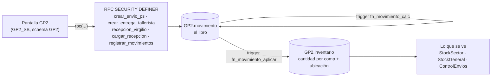
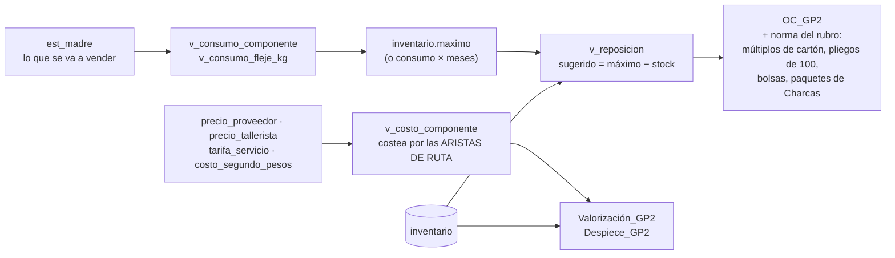
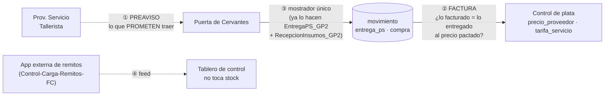

# Croquis de GP2 — cómo funciona hoy (2026-09-13)

> Versión para mirar en el celular (misma info, dibujada):
> https://claude.ai/code/artifact/0004f23b-587f-4d5e-b8c8-bf313836955b

Una frase: **GP2 es un libro de movimientos sobre un catálogo normalizado.** La app nunca calcula
stock; inserta filas en `GP2.movimiento` y los triggers (`fn_movimiento_calc` +
`fn_movimiento_aplicar`) actualizan `GP2.inventario`. Todo sale del schema `GP2` (Regla 0).

---

## 1 · El circuito físico: de la chapa al cliente

**Quién entrega qué no se declara en ninguna tabla suelta: lo dice la RUTA.** Cada artículo tiene
sus `ruta` / `ruta_paso` (tipos: `insumo`, `ingreso`, `matriz`, `proveedor_servicio`, `tallerista`,
`proveedor_at`, `virgilio`), y de ahí sale todo — a quién se le manda, qué devuelve, y quién lo
entrega en Virgilio (el último paso con contraparte antes del paso `virgilio`).

## 2 · El motor: una pantalla nunca toca el stock

Regla de la casa: **si un número de stock se calculó en el JS, está mal.** El JS arma el
movimiento; el stock lo decide la base.

## 3 · La cabeza: qué pedir y cuánto vale

Dos cosas que ya nos mordieron y conviene tener a mano:
- **La receta (`articulo_componente` / `componente_bom`) no costea; costea la ruta.** La receta
  decide qué se DESCUENTA al entregar; el costo sale de los pasos.
- **El sugerido llena el máximo** (máximo − stock), y recién después se aplica la norma del rubro.
  Primero el lugar, después el envase.

---

## 4 · Dónde entran los 4 que faltan

Son los últimos archivos que miran `public` (ver `MIGRACION_PUBLIC_GP2.md`). Ninguno está en el
menú y ninguno está en uso hoy. Puestos en el croquis, **cada uno tapa un agujero distinto**:

| # | Módulo viejo | Dónde se engancha | Qué le falta a GP2 | Si no se hace |
|---|---|---|---|---|
| ① | **Preaviso de Entrega** | **antes** de `entrega_ps` / `entrega_tallerista` | una tabla `preaviso` (contraparte, componente, cantidad, fecha prometida) que después se concilie contra el movimiento real | no se sabe qué va a entrar mañana; el faltante se descubre cuando ya es tarde |
| ② | **Lectura de Facturas** | **después** de `entrega_ps`, del lado de la plata | una `factura` + sus ítems, cruzada contra los movimientos de entrega y contra `precio_proveedor` / `tarifa_servicio` | se paga contra el papel del proveedor, sin cruzar con lo que realmente entregó ni con el precio pactado |
| ③ | **Entrega Prov. Cervantes** | en la puerta, al recibir | **casi nada**: `crear_entrega_ps` y `crear_recepcion_insumo` ya existen y hacen exactamente eso. Lo único distinto de la vieja era ser **un mostrador único** para las dos cosas | nada grave: hoy se hace en dos pantallas (`EntregaPS_GP2` y `RecepcionInsumos_GP2`) |
| ④ | **Control Carga Remitos** | al costado, no toca stock | leer el feed de la app externa que ya existe | se sigue mirando en la página externa, como hoy |

**Orden que tiene sentido si algún día se hacen:** ① (avisa antes, evita el faltante),
② (es plata), ③ (comodidad, no capacidad), ④ (es un tablero ajeno).

---

*Archivos vivos relacionados: `GP2_MAPA.md` (contratos y nombres reales), `MIGRACION_PUBLIC_GP2.md`
(qué queda mirando `public`), `CONOCIMIENTO_GP2.md` (por qué cada cosa es como es).*
